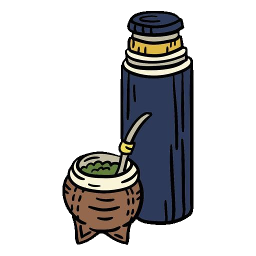

<h1 align="center" border="1" >¡¡¡Hola 🖖!!! Mi nombre es Guillermo </img> </h1>
     

    

## Sobre mí 🧑‍💻 

Soy Front-End Developer y Administrador De Sistemas.  
Estudie en la Universidad del Comahue Administración de Sistemas y software libre.
Estudie en coderhouse la carrera de FrontEnd React, Aparte me fui nutriendo de otros conocimientos, hice reparación avanzada de computadoras. también desarrollo Full-Stack con PHP y maqueado web en UTN.. 

 

***
## Stack actual 💻
HTML, CSS, SCSS, JavaScript, React, Vite, Bootstrap, Además, he trabajado
con bases de datos MariaDB, Mysql y tengo conocimientos en PHP para el
desarrollo Back-end.

 

***
## Ultimos Desafios 🚀

Actualmente estoy participando activamente en No Country para validar mi stack como front-end React. He completado la primera etapa y fui seleccionado para la segunda instancia, donde ya estamos trabajando en nuestro próximo proyecto llamado "truekiando". Esta será una aplicación web para intercambiar productos, permitiendo a los usuarios comunicarse directamente con la persona que ofrece un producto y llevar a cabo transacciones. Puedes seguir el progreso del proyecto en: 

 

### 📊 My Most Used Languages

***
## Espero te guste 😊 
Espero que mi contenido sea de tu agrado, si te gusta lo que hago, dejame una ⭐. ¡Gracias por tu tiempo!.

## :octocat: Mi contacto
#### :bust_in_silhouette: [Guillermo Agustín Neculqueo](@guillenec)

#### :envelope: [guillermoneculqueo@gmail](guillermoneculqueo@gmail.com)

    
